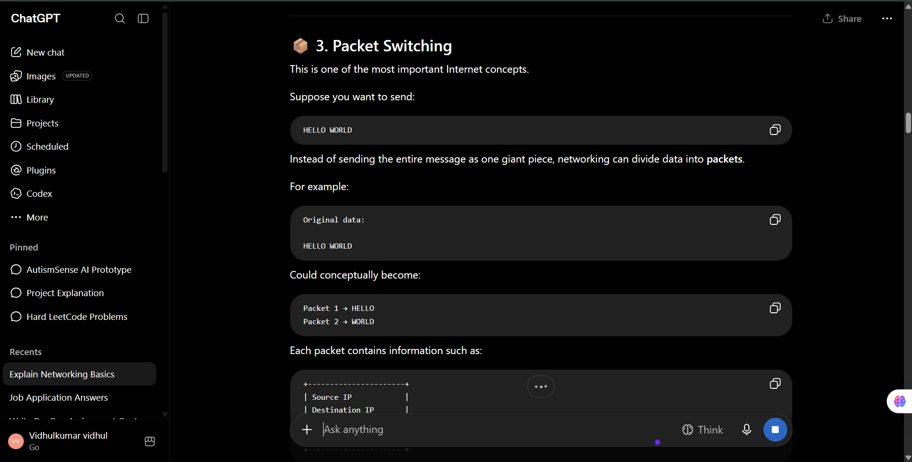
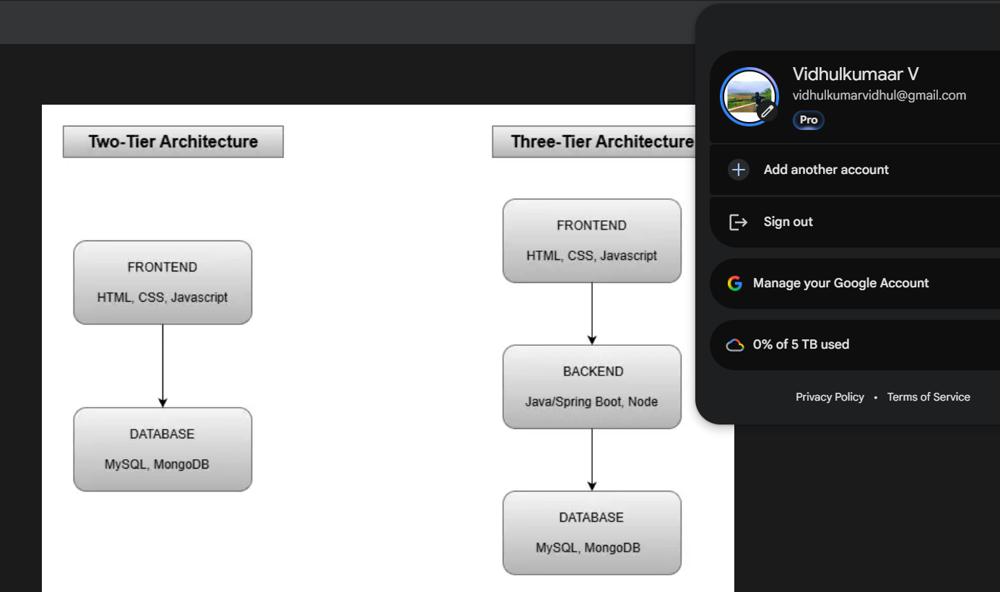
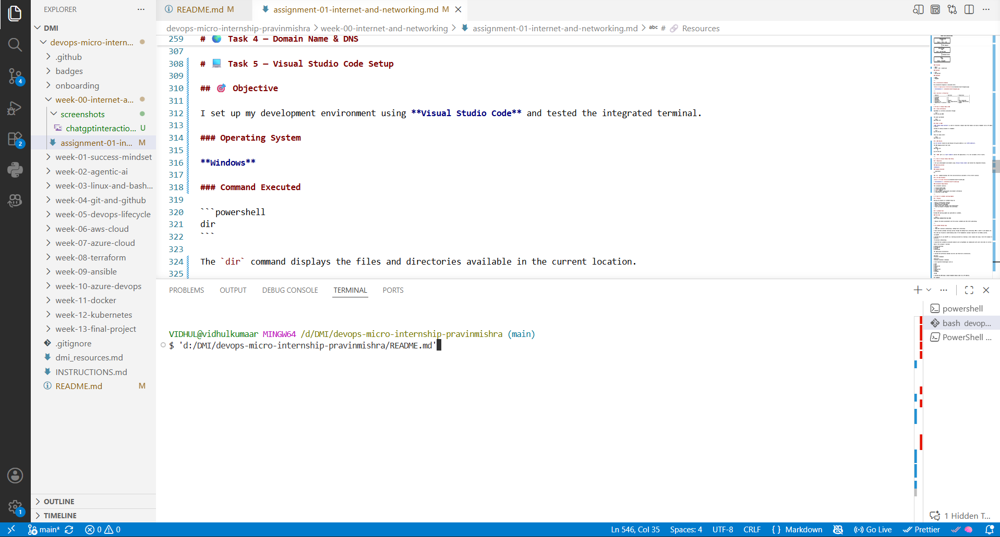

# 🚀 DevOps Micro Internship — Week 00

## Internet & Networking Fundamentals

**DMI Cohort 3 — Agentic AI Track**

---

## 👨‍💻 Student Information

| Details      | Information                                                           |
| ------------ | --------------------------------------------------------------------- |
| **Name**     | Vidhulkumaar V                                                        |
| **GitHub**   | [vidhulkumaar](https://github.com/vidhulkumaar)                       |
| **LinkedIn** | [Vidhulkumaar V](https://www.linkedin.com/in/vidhulkumaar-vaiyapuri/) |
| **Location** | Tamil Nadu, India                                                     |
| **Program**  | DevOps Micro Internship                                               |
| **Cohort**   | Cohort 3                                                              |
| **Track**    | Agentic AI                                                            |

---

# 📌 Week 00 Learning Goals

This week was focused on understanding the basic concepts that form the foundation of DevOps.

### Topics Covered

* 🤖 ChatGPT as a learning assistant
* 🌐 Internet and networking
* 📦 Packet switching
* 🔢 IP addresses
* 🔗 TCP/IP
* 🔐 HTTP and HTTPS
* 🏗️ Application architecture
* 🌍 DNS
* 💻 Visual Studio Code
* 💼 Professional learning documentation through LinkedIn

---

# 🧑‍💻 Task 1 — ChatGPT as a Learning Assistant

## 🎯 Objective

The goal of this task was to learn how to create a useful prompt that gives a beginner-friendly technical explanation.

### Prompt

```text
I am a beginner who is currently learning networking as part of my DevOps journey.

Please explain the following question in very simple terms:

"What is a protocol in networking?"

Please:
1. Explain the concept as if I have no prior networking knowledge.
2. Avoid unnecessary technical jargon.
3. Give me one simple real-life example.
4. Explain how the real-life example relates to computer networking.
5. Keep the explanation short but clear.
```

### 💡 What I Understood

A **networking protocol** is a set of rules that computers and other devices follow when communicating with each other.

For example, when two people communicate, they need a common language and certain rules to understand each other. Similarly, computers use protocols such as TCP/IP and HTTP to communicate correctly over a network.

## 📸 screenshots

The interaction is captured in the following screenshot:



> **Screenshot:** `screenshots/task-1-chatgpt.png`

---

## 📝 What I Learned

I learned that networking protocols are basically communication rules used by devices. I also understood that using a good prompt can make complex technical topics easier to learn.

---

# 🌐 Task 2 — Internet & Networking

## 🎯 Scenario

EpicReads is an online bookstore whose website is hosted on a server located in **Finland**.

The objective is to understand how a customer from another country can access the website.

## 📖 ANSWER

When a customer accesses the EpicReads website, the information travelling between the user's device and the server is divided into small units called **packets**. These packets can travel through different networks before reaching the destination. This process is known as **packet switching**.

An **IP address** identifies a device or server on the network and helps determine where the packets need to go. **TCP/IP** provides the communication rules that allow devices to exchange data across the internet.

After reaching the EpicReads server in Finland, **HTTP or HTTPS** is used for communication between the browser and the website. HTTPS is preferred because it encrypts the communication and provides better protection for information such as passwords and payment details.

---

# 🏗️ Task 3 — Application Architecture

## 🎯 Objective

EpicReads can be designed using either a **two-tier** or **three-tier** architecture.

---
## 2️⃣ Two-Tier Architecture

A two-tier application has two main parts:

**Frontend → Database**

### Frontend Technologies

* HTML
* CSS
* JavaScript

### Database Technologies

* MySQL
* MongoDB

---

## 3️⃣ Three-Tier Architecture

A three-tier application separates the application into:

**Frontend → Backend → Database**

### Frontend

* React
* HTML / CSS / JavaScript

### Backend

* Java
* Spring Boot

### Database

* MySQL
* MongoDB

---

## 📸 Architecture Evidence

My architecture diagram is available here:



> **Screenshot:** `screenshots/task-3-diagram.png`

---

## ⚖️ Two-Tier vs Three-Tier

| Feature                | Two-Tier           | Three-Tier          |
| ---------------------- | ------------------ | ------------------- |
| Frontend               | ✅                  | ✅                   |
| Backend                | ❌                  | ✅                   |
| Database               | ✅                  | ✅                   |
| Structure              | Simpler            | More organized      |
| Suitable for           | Small applications | Larger applications |
| Separation of concerns | Lower              | Higher              |

---

# 🌍 Task 4 — Domain Name & DNS

## 🎯 Given Information

EpicReads is currently accessible through:

```text
52.172.142.222:3000
```

The owner purchased:

```text
epicreads.com
```

## ❓ What is DNS?

**DNS (Domain Name System)** is used to translate a domain name that humans can easily remember into an IP address that computers use to locate a server.

Instead of asking customers to remember:

```text
52.172.142.222
```

they can simply enter:

```text
epicreads.com
```

## 📌 DNS Record

An **A record** should be used because the given address is an **IPv4 address**.

The DNS mapping would look like:

```text
epicreads.com
       │
       ▼
52.172.142.222
```

The `:3000` part is a **port number** used by the application. It is not included in the A record.

---

# 💻 Task 5 — Visual Studio Code Setup

## 🎯 Objective

I set up my development environment using **Visual Studio Code** and tested the integrated terminal.

### Operating System

**Windows**

### Command Executed

```powershell
dir
```

The `dir` command displays the files and directories available in the current location.

## 📸 VS Code Evidence



> **Screenshot:** `screenshots/task-5-vscode.png`

### Screenshot Requirements

The screenshot contains:

* ✅ Visual Studio Code
* ✅ Integrated terminal
* ✅ `dir` command
* ✅ My username / identifiable environment information
* ✅ Selected VS Code theme

---

# 🔗 Task 6 — LinkedIn Learning Update

## 🎯 Purpose

Sharing my progress on LinkedIn helps me:

* Build a professional presence
* Document my learning journey
* Share technical knowledge
* Connect with other learners and professionals
* Track my progress throughout the internship

---

## 🔗 LinkedIn Post

My Week 00 learning update was published on LinkedIn.

### Post URL

https://lnkd.in/p/gvYNgBaE

# 📋 LinkedIn Backup Copy

```text
🚀 Week 00 — Internet & Networking | DevOps Micro Internship

I have started my DevOps learning journey through the DevOps Micro Internship (DMI) — Cohort 3 with Agentic AI.

This week was focused on understanding some of the fundamental concepts required for my DevOps journey.

🤖 ChatGPT

I learned how to use ChatGPT as a learning assistant by creating a clear prompt and using a real-life example to understand networking protocols.

🌐 Internet & Networking

I explored how a globally accessible website such as EpicReads can communicate with users even when its server is hosted in Finland.

Some of the concepts I learned:

• Packet Switching
• IP Address
• TCP/IP
• HTTP/HTTPS

🏗️ Application Architecture

I learned the difference between two-tier and three-tier architectures.

Two-Tier:
Frontend → Database

Three-Tier:
Frontend → Backend → Database

I also explored technologies such as:

• HTML
• CSS
• JavaScript
• React
• Java
• Spring Boot
• MySQL
• MongoDB

🌍 DNS

I learned how DNS maps a human-readable domain name to an IP address.

For example:

epicreads.com → 52.172.142.222

An A record is used because the address is an IPv4 address.

💻 VS Code

I configured Visual Studio Code and used its integrated terminal to execute the Windows `dir` command.

📚 Week 00 gave me a better understanding of the networking and application fundamentals that are important for DevOps.

I'm looking forward to learning more, gaining hands-on experience, and building better projects throughout this journey! 🚀

P.S. This post is part of the DevOps Micro Internship (DMI) with Agentic AI — Cohort 3 — by Pravin Mishra.

My graded progress is public:
https://dmi.pravinmishra.com/s/vidhulkumaar.html

Start your DevOps journey:
https://dmi.pravinmishra.com/?utm_source=student&utm_medium=ps-linkedin&utm_campaign=cohort3

Tag Pravin Mishra in your LinkedIn post, then tag Lead Co-Mentor — Anjana Muthunayake.

#DMIByPravinMishra #AgenticAI #DevOps
```

---

# 🪞 Week 00 Reflection

## 😊 What Did I Find Easy?

The basic concepts of IP addresses, DNS, HTTP/HTTPS, and application architecture were easier to understand because they could be connected with real-world examples.

---

## 🤔 What Was Difficult?

Understanding how a request travels from a user's device through multiple networks to a server was initially difficult. I also needed some time to understand how different networking concepts work together.

---

## 📈 What Will I Improve Next Week?

Next week, I want to focus more on practical DevOps activities instead of only learning theory. I will also work on improving my communication skills and my ability to explain technical concepts clearly.

---

# 📊 Week 00 Progress

| Task | Topic                      | Status                         |
| ---- | -------------------------- | ------------------------------ |
| 01   | ChatGPT Learning Assistant | ✅ Completed                    |
| 02   | Internet & Networking      | ✅ Completed                    |
| 03   | Application Architecture   | ✅ Completed                    |
| 04   | DNS                        | ✅ Completed                    |
| 05   | VS Code Setup              | ✅ Completed                    |
| 06   | LinkedIn Post              | 🔄 Update URL after publishing |

---

# 📁 Repository Structure

```text
Week-00/
│
├── README.md
│
└── screenshots/
    ├── task-1-chatgpt.png
    ├── task-3-diagram.png
    └── task-5-vscode.png
```

---

# 🎓 Key Takeaways

After completing Week 00, I have a basic understanding of:

```text
Internet
   │
   ├── IP Address
   │
   ├── Packet Switching
   │
   ├── TCP/IP
   │
   ├── HTTP / HTTPS
   │
   └── DNS
        │
        ▼
   Domain → IP Address
```

I also learned that application architecture can be separated into different layers:

```text
User
  ↓
Frontend
  ↓
Backend
  ↓
Database
```

These concepts provide a foundation for understanding how modern applications are developed, deployed, and accessed.

---

# 📌 About DMI

The **DevOps Micro Internship (DMI)** is a project-based learning program focused on DevOps fundamentals, real-world execution, systems thinking, and career readiness.

The program helps learners develop practical skills through hands-on tasks and continuous learning.

---

# 🔗 Resources

| Resource                         | Link                                                   |
| -------------------------------- | ------------------------------------------------------ |
| 🌐 DMI Official Website          | https://dmi.pravinmishra.com                           |
| 🎓 University                    | https://university.pravinmishra.com                    |
| 💬 Discord Community             | https://discord.pravinmishra.com                       |
| 📝 DMI Blog                      | https://dmi.pravinmishra.com/blog                      |
| ▶️ DMI Cohort 3 YouTube Playlist | https://www.youtube.com/playlist?list=PLFeSNDtI4Cho    |
| 🔗 Pravin Mishra                 | https://www.linkedin.com/in/pravin-mishra-aws-trainer/ |
| 🏢 CloudAdvisory                 | https://www.linkedin.com/company/thecloudadvisory/     |

---

## 🏁 Final Note

> **Week 00 completed — building the foundation for my DevOps journey. 🚀**

I am looking forward to applying these fundamentals in upcoming weeks through more hands-on projects and practical DevOps tasks.

---

**DMI Cohort 3 — Agentic AI Track**

**#DMIByPravinMishra #AgenticAI #DevOps**
